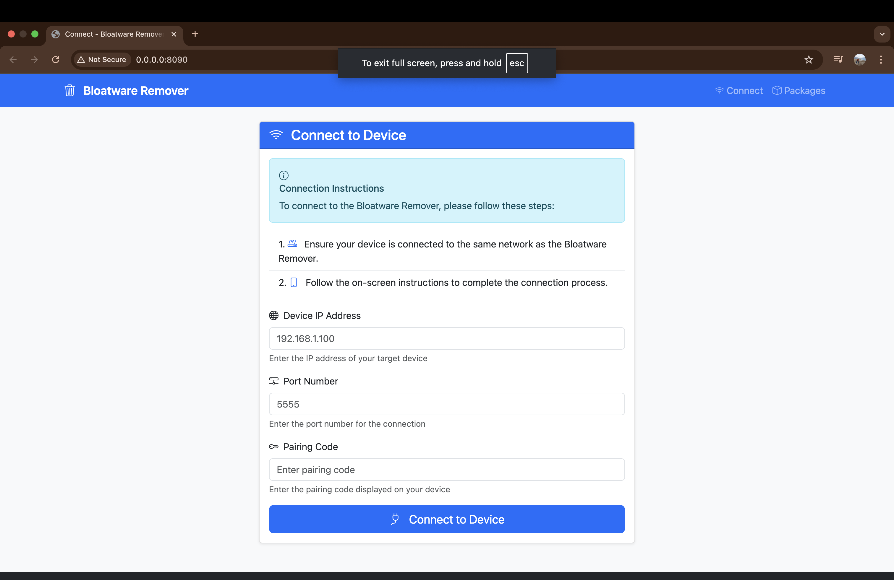
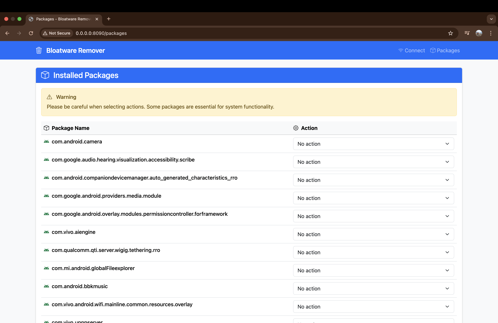

# Bloatware Remover 🗑️

A modern web-based tool for safely removing bloatware from Android devices using ADB (Android Debug Bridge). Built with FastAPI and Bootstrap 5, providing a user-friendly interface for package management.


## ✨ Features

- **🔌 Easy Device Connection**: Simple ADB pairing with IP address and port
- **📦 Package Management**: View all installed packages on your device
- **⚡ Bulk Operations**: Select multiple packages for disable/uninstall actions
- **🛡️ Safe Operations**: Built-in warnings and confirmation for system packages
- **📱 Responsive Design**: Modern Bootstrap 5 interface that works on all devices
- **🔍 Real-time Status**: Live feedback on operation success/failure
- **🎨 Beautiful UI**: Clean, professional interface with Bootstrap components

## 🧰 First Run Instructions (macOS & Linux)

Users can directly download the binaries from the release page and do the following steps. Our project has been downloaded  times.

### Mark the binary executable (macOS/Linux)
```bash
chmod +x ./bloatware-remover
./bloatware-remover
```

### macOS Gatekeeper (no Apple Developer certificate)
If you see “App is damaged or can’t be opened” / “Developer cannot be verified”:

- Method A (recommended):
  1. Right-click the app (or binary) → Open
  2. Click “Open”
  3. Or go to System Settings → Privacy & Security → scroll to “Security” → click “Allow Anyway”, then run again

- Method B (terminal):
```bash
xattr -d com.apple.quarantine ./bloatware-remover
./bloatware-remover
```

## 📖 Usage Guide

### 1. Connect to Your Device

1. Enable **Developer Options** on your Android device
2. Enable **USB Debugging** and **Wireless Debugging**
3. Note your device's IP address and port from the wireless debugging settings
4. Enter the IP address, port, and pairing code in the web interface
5. Click "Connect to Device"

### 2. Manage Packages

1. Once connected, you'll see a list of all installed packages
2. Select actions for each package:
   - **No action**: Leave package unchanged
   - **Disable**: Disable the package (can be re-enabled later)
   - **Uninstall**: Remove the package completely
3. Use bulk action buttons for quick selection
4. Click "Apply Actions" to execute your changes

### 3. Monitor Status

- View operation results and any failed actions
- Navigate back to package management or connection

## 📷 Previews

[](https://github.com/prithvitewatia/bloatware-remover)
[](https://github.com/prithvitewatia/bloatware-remover)

## 🔧 Configuration

### Environment Variables

No environment variables are required for basic usage. The application uses default settings suitable for most use cases.

### ADB Configuration

Ensure ADB is properly configured:
```bash
# Check if ADB is available
adb version

# Start ADB server
adb start-server
```

## 📱 Supported Devices

- Android devices with ADB support
- Devices running Android 4.0+ (API level 14+)
- Both USB and wireless debugging connections

## ⚠️ Important Notes

### Safety Warnings

- **System Packages**: Be careful when disabling system packages as they may be essential for device functionality
- **Backup**: Consider backing up your device before making changes
- **Research**: Research packages before disabling/uninstalling to avoid breaking system functionality

### Limitations

- Requires ADB access to the device
- Some packages may be protected and cannot be modified
- Wireless debugging requires device and computer on same network

## 🚀 Quick Start

### Prerequisites

- Python 3.8 or higher
- ADB (Android Debug Bridge) installed and in your PATH
- Android device with USB debugging enabled
- Device connected to the same network as your computer

### Installation

1. **Clone the repository**
   ```bash
   git clone https://github.com/prithvitewatia/bloatware-remover.git
   cd bloatware-remove
   ```

2. **Create a virtual environment**
   ```bash
   python -m venv .venv
   source .venv/bin/activate  # On Windows: .venv\Scripts\activate
   ```

3. **Install dependencies**
   ```bash
   pip install -r requirements.txt
   ```

4. **Run the application**
   ```bash
   python -m uvicorn src.main:app --reload --host 0.0.0.0 --port 8000
   ```

5. **Open your browser**
   Navigate to `http://localhost:8000`

## 🛠️ Technical Details

### Architecture

```
bloatware-remove/
├── src/
│   ├── main.py              # FastAPI application entry point
│   ├── routes.py            # API routes and request handling
│   ├── bloatware_removal.py # Core business logic
│   └── templates/           # HTML templates with Bootstrap 5
│       ├── base.html        # Base template with navigation
│       ├── connect.html     # Device connection interface
│       ├── packages.html    # Package management interface
│       ├── status.html      # Operation status display
│       └── components/      # Reusable template components
├── tests/                   # Test files
└── requirements.txt         # Python dependencies
```

### Key Components

- **ConnectionManager**: Handles ADB device pairing
- **PackageManager**: Manages package operations (list, disable, uninstall)
- **CommandManager**: Executes ADB commands safely
- **Web Interface**: Modern Bootstrap 5 templates with responsive design

### Dependencies

- **FastAPI**: Modern web framework for building APIs
- **Uvicorn**: ASGI server for running FastAPI applications
- **Jinja2**: Template engine for HTML rendering
- **python-multipart**: Form data parsing

## 🤝 Contributing

We welcome contributions! Please feel free to submit a Pull Request. For major changes, please open an issue first to discuss what you would like to change.

### Development Setup

1. Fork the repository
2. Create a feature branch (`git checkout -b feature/amazing-feature`)
3. Commit your changes (`git commit -m 'Add amazing feature'`)
4. Push to the branch (`git push origin feature/amazing-feature`)
5. Open a Pull Request

## 📄 License

This project is licensed under the MIT License - see the [LICENSE](LICENSE) file for details.

## 🙏 Acknowledgments

- [FastAPI](https://fastapi.tiangolo.com/) for the excellent web framework
- [Bootstrap](https://getbootstrap.com/) for the beautiful UI components
- [Android Debug Bridge](https://developer.android.com/studio/command-line/adb) for device communication

## 📞 Support

If you encounter any issues or have questions:

1. Check the [Issues](https://github.com/prithvitewatia/bloatware-remover/issues) page
2. Create a new issue with detailed information
3. Include your device model, Android version, and error messages

## ☕ Support the Project

If you find this tool helpful, consider supporting its development:

- **GitHub Sponsors**: [Sponsor @prithvitewatia](https://github.com/sponsors/prithvitewatia)
- **PayPal**: [Donate via PayPal](PayPal.Me/PrithviSinghDev)

### 🎯 Funding Goals
- [ ] Apple Developer License ($99/year) - Remove macOS Gatekeeper warnings
- [ ] Build and ship new and exciting features

---

**Disclaimer**: This tool is provided as-is. Use at your own risk. The authors are not responsible for any damage to your device or data loss. 